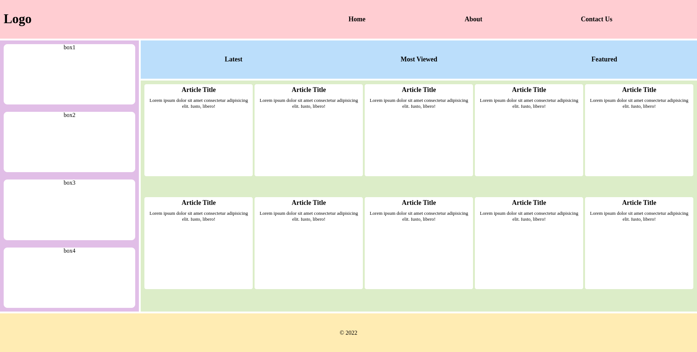
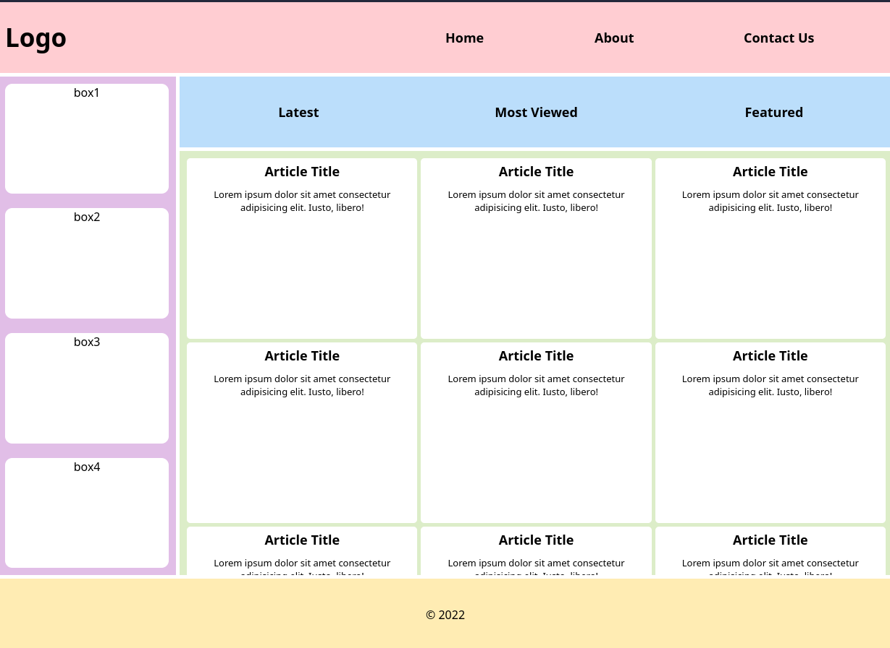

# Advanced Grid Layout

Create the following layout using CSS Grid.

You are free to change the looks of the website, change the boxes on the side bar to images,
change the card articles to something else, it's totally up to you.

The main objective is to create a layout as close as you can to the images below, it doesn't have to be pixel perfect.

### Desired result:

---

If you use the `auto-fit` with the article, the columns should be adjusted based on size like the following:

---

### Check List:

- The `container` element has two columns.
- The `container`'s second column is **4** times larger than the first column.
- The `container` element has a gap of `5px`.
- The `header` element spans **2** columns.
- The `menu-list` element contains another grid.
- The `nav-list` element contains another grid.
- The `nav-items` & `menu-items` & `logo` items are centred using grid properties.
- The `sidebar` element has a gap of `20px`.
- The `article` element should set grid columns using `repeat` along with the `auto-fit` and `minmax` properties.
- The `article` columns should have a minimum value of `250px` and a maximum of `1fr` unit.
- The `article` element has a gap of `5px`.
- The `article` will allow scrolling when there's no space for
  other rows in the div using the `overflow` property.
- The `article-card` elements inside the article container have a height of `250px`.
- The `footer` span **2** columns.
- The `sidebar` only spans across the first column.
- The `nav-list` and `article` elements only span across the second column.
